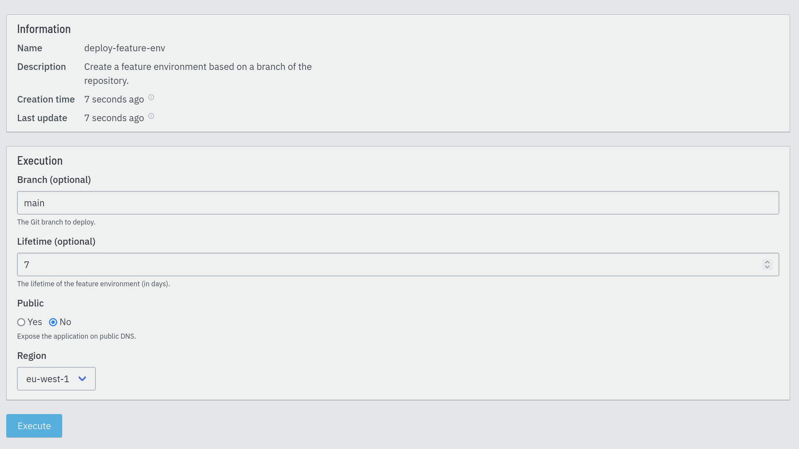

== Executing jobs

Jobs act as simple definitions. For their steps to be executed, they need to
be instantiated. The instantiation process creates a job execution containing
everything required for one run. The job execution is then stored, waiting for
scheduling.

=== Triggers

Each job can contain a trigger which specifies when to execute it. The trigger
defines an event, a set of parameters and optional additional filters. When
the event occurs and filters match, Eventline instantiates the job.

If a job does not contain a trigger, it will never be instantiated
automatically, but can still be executed manually.

.Example
[source,yaml]
----
name: "stable-branch-commits"
trigger:
  event: "github/push"
  parameters:
    organization: "my-organization"
    repository: "my-product"
  filters:
    - path: "/branch"
      is_equal_to: "stable"
  identity: "github-oauth2"
----

See the <<trigger-spec,trigger specification>> for a list of all trigger
fields.

=== Events

Events represent something that happened and that was detected by Eventline.
When an event is created, Eventline looks for matching triggers and
instantiates associated jobs.

See the <<chapter-connectors,connector documentation>> for a list of all
events in each connector.

==== Replay

Event replay is an advanced feature designed to help people re-execute jobs as
if the original event was received again.

When an event is replayed, a new event is created with the same connector,
event type and data. Eventline will look for matching triggers and execute any
associated job.

This feature is particularly useful when writing complex jobs. Event replay
makes it easy work on new definitions of your job. Update your job, deploy the
project, and simply replay the original event to see what happens.

=== Manual execution

All jobs can be executed manually, either on the web interface or using the
`execute-job` Evcli command.

On the web interface, Eventline dynamically generates a form to provide the
parameters defined by the job.

A job execution instantiated manually does not have any associated event.

CAUTION: If you define a job to be executable with either a trigger or manual
execution, you need to make sure that the code executed by the job handle the
fact that there may or may not be an available event.

=== Lifecycle

Job executions have one of the following status:

`created` :: The job execution has just been created and is waiting for
scheduling.

`started` :: The job execution is currently running.

`aborted` :: The job execution was stopped before completion, usually by an
action of a user.

`successful` :: The job execution has completed successfully.

`failed` :: The job execution has failed, either because one of the steps
failed or due to an internal error.

Each step in the job execution has a status code with the same possible
values, allowing users to track the execution process.

Users can affect this lifecycle by aborting or restarting jobs. Both actions
can be done on the web interface, with Evcli or with the HTTP API.

[#job-execution-timeout]
=== Timeouts

Job executions are refreshed on a regular basis once they have been started.
A separate worker monitors jobs and stops those which have not been refreshed
for some time. This mechanism is useful in two situations:

* If Eventline is killed, for example due to `SIGKILL` or a server failure,
  jobs which were running will ultimately be detected and stopped instead of
  staying in a `started` status forever.

* If a runner is stuck due to an external system or because of an unexpected
  error, the job execution associated with it will ultimately be stopped.

This system is controlled by controlled by two settings:

`job_execution_refresh_interval` :: the interval between two refresh in
seconds.

`job_execution_timeout` :: the time after which a non-refreshed job execution
is considered dead in seconds.

See the <<configuration,configuration documentation>> for more information.

==== Abortion

Created or started job executions can be aborted. If execution has not started
yet, it will be cancelled. If the job is running, Eventline will try to
stop it. Steps which have not been executed yet will have status `aborted`.

==== Restart

Finished job executions can be restarted. When that happens, the job execution
is reinitialized, ready for scheduling. Job executions are restarted using the
same job specification, even if the definition of the job was changed in the
mean time.

Note that the content of identities is not part of job definitions: if an
identity is changed, execution after a restart will use the new set of
identity data.

CAUTION: Eventline is a scheduling platform: jobs execute code which usually
affect external systems. Restarting a job could have unexpected consequences
regarding these systems. In general, writing jobs in an idempotent way will
help a lot in keeping your technical processes robust.

=== Runtime environment

==== Filesystem

All runners create and populate a directory containing various files useful
during execution.

`context.json` :: The execution context.

`parameters/` :: A directory containing a file for each parameter of the job
if there are any. For example, if the job has a `username` parameter, its
value is stored in `parameters/username`.

`event/` :: A directory containing a file for each field in the event if there
is one. For example, in a `github/raw` event, the delivery id is stored in
`event/delivery_id`.

`identities/<name>/` :: A set of directories, one for each identity listed in
the job, containing a file for each field of the identity. For example, if a
job uses a `github/oauth2` identity named `gh`, the access token will be
available in `identities/gh/access_token`.

CAUTION: The location of this directory depends on the runner due to technical
limitations; always use the `EVENTLINE_DIR` to build paths.

Having event and identity fields available as simple text files makes it
really simple to write jobs written as shell scripts. Using the previous
example, reading the access token of the identity in shell in trivial:
[source,sh]
----
access_token=$(cat $EVENTLINE_DIR/identities/gh/access_token)
----

Alternatively, in higher level languages, simply load `context.json` and
access all data directly.

==== Execution context

The execution context is available in `$EVENTLINE_DIR/context.json`; the
top-level object contains the following fields:

`event` (object) :: The event object if the job execution was instantiated in
reaction to an event.

`identities` (object) :: The set of all identities listed in the job.

`parameters` (object) :: The set of job parameters.

==== Environment variables

Eventline injects several environment variables during the execution of each
job:

`EVENTLINE` :: Always set to `true`, indicating that the task is being
executed in the Eventline platform.

`EVENTLINE_PROJECT_ID` :: The identifier of the current project.

`EVENTLINE_PROJECT_NAME` :: The name of the current project.

`EVENTLINE_JOB_ID` ::  The identifier of the current job.

`EVENTLINE_JOB_NAME` ::  The name of the current job.

`EVENTLINE_DIR` :: The absolute path of the directory containing Eventline
data, including the context file.
