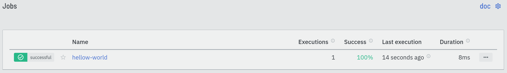
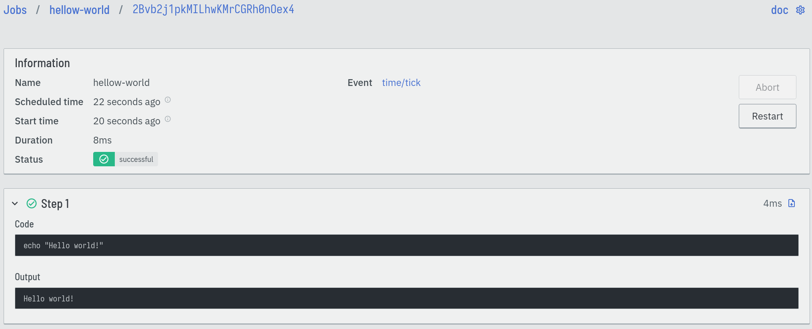

== Getting started

In this chapter, we will install Eventline and get it ready to use. While
there are multiple ways to deploy Eventline depending on your needs, we will
use https://docs.docker.com/compose[Docker Compose] to run everything locally
with minimum effort.

You will need a UNIX system supporting Docker Compose, for example Linux or
Mac OS, with Docker and Docker Compose installed.

=== Evenline

==== Installation

First download the Docker Compose definition file, `docker-compose.yaml`,
provided with each Eventline release. You can either get it on
https://github.com/exograd/eventline/releases/latest[GitHub release page] or
download it directly from
https://github.com/exograd/eventline/releases/latest/download/docker-compose.yaml.

Run Docker Compose in the directory you downloaded the file to:
----
docker-compose up -d
----

You now have Eventline running along its PostgreSQL database. It also includes
https://mailcatcher.me[MailCatcher] so that you can send email notifications
without having to configure access to an email server.

Start your favourite web browser and open http://localhost:8087. You should
see the login page of Eventline.

==== First connection

The first time Eventline starts, it creates an account with username `admin`
and `password`. Use these credentials to connect to the web interface.

Start by going to the "Account" section and click the "Change password"
button. Choose a strong password to protect the admin account.

CAUTION: When installing Eventline, always change the default password
immediately after starting the platform to prevent unauthorized access.

=== Evcli

==== Installation

Evcli is the command line tool used to interact with Eventline. You can also
get it from the https://github.com/exograd/eventline/releases/latest[GitHub
release page], where it is available as a binary for all supported platforms,
or simply use our installation script:
----
curl -sSLf https://github.com/exograd/eventline/releases/latest/download/install-evcli | sh -
----

At this point, you should be able to run `evcli version` and see the version
number of the last release.

NOTE: `install-evcli` put the `evcli` executable file in `/usr/local/bin`.
Therefore you should make sure that the `PATH` environment variable contains
this location.

==== Authentication

Eventline uses keys to authenticate clients on the API. While you could create
an API key manually and add it to the Evcli configuration file, it is much
simpler to use the `login` command.

Run `evcli login`; the command asks for the endpoint (prefilled as
"http://localhost:8085", which will work for the current setup), username and
password, then takes care of everything.

To make sure everything works as intended, run `evcli list-projects`. You
should see the default project, `main`.

=== Writing your first job

Now that everything is running, let us write a job. Eventline jobs are small
YAML documents describing when, where and how to run the job. Open a file
named `hellow-world.yaml` with your favourite text editor and copy the
following content:

[source,yaml]
----
name: "hellow-world"
trigger:
  event: "time/tick"
  parameters:
    periodic: 30
steps:
  - code: |
      echo "Hello world!"
----

We define a job and give it a name. We then describe when to run the job using
a trigger: the job will react to the `tick` events from the `time` connector,
and will be executed periodically, every 30 seconds. Finally we provide the
code to run as a list of steps.

Save the file, and deploy the job using Evcli:
----
evcli deploy-job hello-world.yaml
----

This is it! The job is now saved in Eventline and will be executed every 30
seconds as requested. Open your web browser; on the "Jobs" page, you can see
your new `hello world` job:

If you click on it, you will see the job execution page, which lists all
executions of this job.

After a few seconds, Eventline should execute the job for the first time. You
can see its status changes in real time. You can also click on this particular
execution and see the status and output of each step:

You can now delete job: go to the "Jobs" page, click on the "..." button to
the right of the "hello-world" list entry, and select "Delete". This will
delete the job and all its executions.

Alternatively, you can use Evcli:
----
evcli delete-job hello-world
----

In the next chapters, we will explore more advanced features of Eventline.
