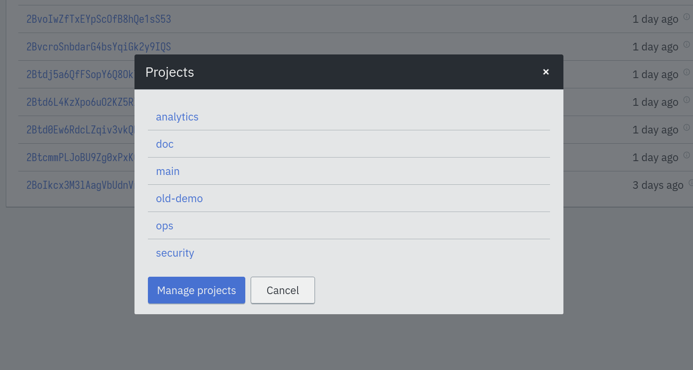

== Organization with projects

It is easy to create lots of jobs and identities and end up having trouble
finding what you need. To help with organization, Eventline provides a
namespace mechanism, projects.

A project contains jobs and identities and keep them separate from other
projects. When you are using the web interface, Evcli or the HTTP API, you
only interact with a single project.

=== Project selection

==== Web interface

On the web interface, you can change the current project by clicking on the
project name on the top right part of the page to access to project selector:

==== Evcli

With Evcli, the `-p`, `--project` and `--project-id` options can be used to
select the project you want to interact with. Refer to the
<<chapter-evcli,Evcli documentation>> for more information.

=== Configuration

You can configure a project by clicking on the gear icon on the top right of
the web interface.

The following settings are available:

Code header :: A fragment of code inserted at the beginning of each `code`
block of each step in all jobs in the project unless the block already
contains a https://en.wikipedia.org/wiki/Shebang_(Unix)[Shebang line]. The
default value is:
+
[source,sh]
----
#!/bin/sh

set -eu
----

=== Notifications settings

Each project can specify when notifications have to be sent.

You can send notifications in the following situations:

* When jobs succeed.
* When jobs succeed for the first time after one or more failures or abortions.
* When jobs fail.
* When jobs are aborted.
* When OAuth2 identities cannot be refreshed.

You can also provide a list of email addresses to send notifications to.

TIP: If you want to send notifications to several people, e.g. an entire team,
it is advised to create a user group in the software managing emails in your
organization. You can then use the group address as recipient for
notifications.
