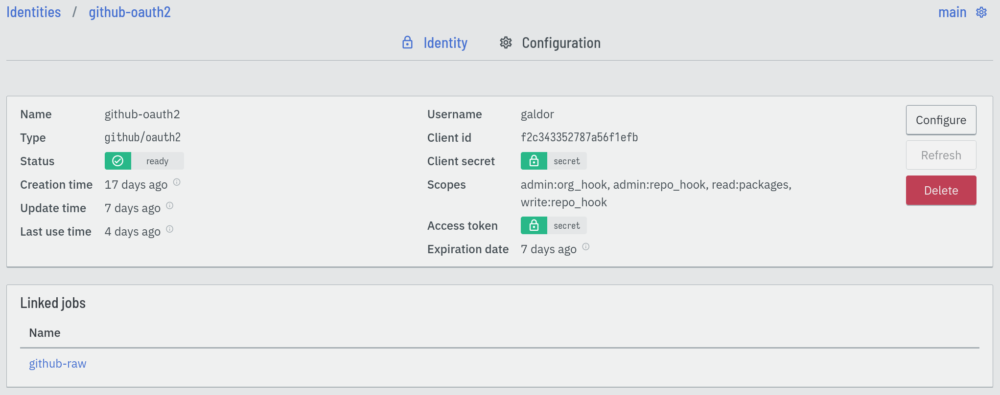

== Using identities

Identities provide a way to store credentials of various types. Each identity
contains a set of typed values, making it possible to store secrets more
complex than single passwords or keys

Connectors provide identities; for example, the `github` connector contains
identities for the authentication mechanisms of the GitHub platform. Refer to
the <<chapter-connectors,connector documentation>> for a list of all available
identities.

Eventline encrypts identity data in the database using AES-256-CBC with the
global encryption key.

=== Lifecycle
Identities have one of the following statuses:

`pending` :: The identity has been created, but some parts of the
  initialization process have not completed.

`ready` :: The identity has been created and initialized, and is ready to be
used.

`error` :: An error occurred during the initialization process of the
identity.

Identities with statuses `pending` or `error` cannot be used in jobs.

Most identities are self-sufficient and will be ready as soon as they are
created. Others, such as OAuth2 identities, require extra initialization steps
to get ready. If these steps are not completed, for example if the web browser
is closed during a redirection, the identity will stay with the `pending`
status. If one of these steps fails, the identity will have the `error`
status, and an error message will be displayed on the identity view page.

Editing an identity will always reset their state, and the platform will
restart all initialization steps. If your identity is stuck with the `pending`
or `error` state, simply edit it to restart the initialization process.

=== Refresh
Some identities must be refreshed on a regular basis. This is the case for
OAuth2 identities which contain a refresh token: it must be used to regularly
fetch an access token. Without the refresh process, the access token will
expire.

When an OAuth2 provider supports refresh tokens, for example Slack, Eventline
will regularly use them to obtain new access tokens and store them in the
identity.

If the refresh process fails, Eventline will send an email notification. See
the <<project-notification-settings,notification settings documentation>> for
more information.

Users can also force a refresh at any moment using the "Refresh" button on the
page of the identity.
